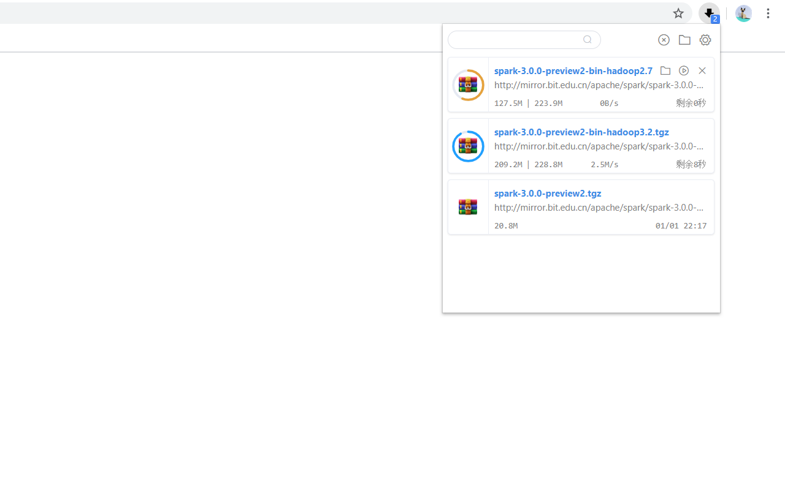
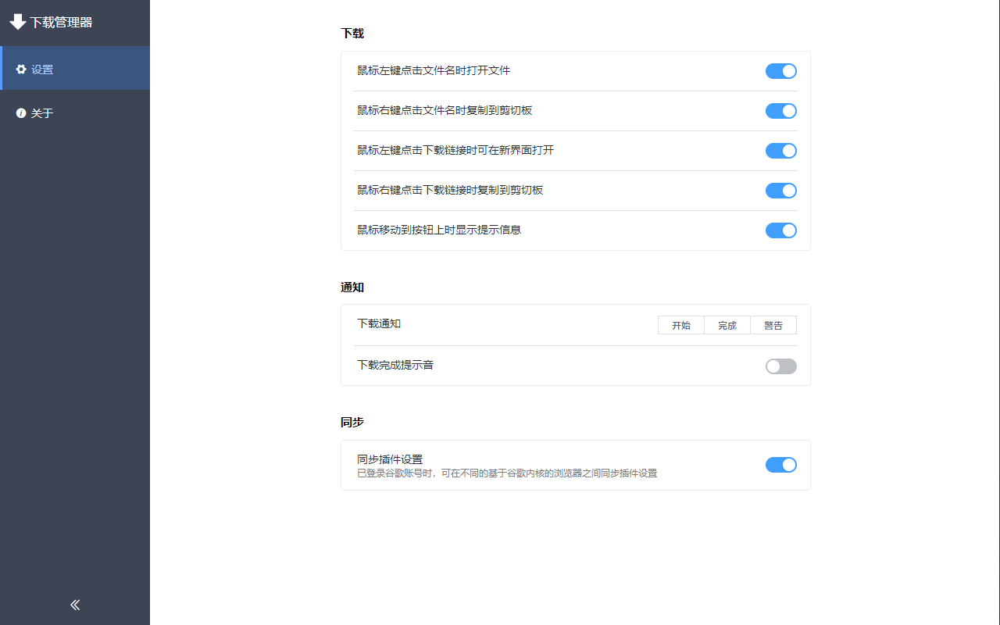

# **download-manager**
[](https://www.travis-ci.org/xinghaix/download-manager)


[](https://github.com/xinghaix/download-manager/blob/master/LICENSE)

[](https://chrome.google.com/webstore/detail/ofpglhlcdbjdhlacgbljnildhajfmlei)
[](https://chrome.google.com/webstore/detail/ofpglhlcdbjdhlacgbljnildhajfmlei)
[](https://chrome.google.com/webstore/detail/ofpglhlcdbjdhlacgbljnildhajfmlei)

[](https://microsoftedge.microsoft.com/addons/detail/phalbpghhjknlmomkmimbamfceiddlic)
[](https://microsoftedge.microsoft.com/addons/detail/phalbpghhjknlmomkmimbamfceiddlic)

谷歌浏览器下载管理器插件  
点击插件图标即可查看所有下载文件状态


### 1. 语言
**[简体中文](../README.md) | [English](docs/README_EN.md)**

### 2. 下载安装
[Chrome Web Store](https://chrome.google.com/webstore/detail/%E4%B8%8B%E8%BD%BD%E7%AE%A1%E7%90%86%E5%99%A8/ofpglhlcdbjdhlacgbljnildhajfmlei) 、
[Microsoft Edge Add-ons](https://microsoftedge.microsoft.com/addons/detail/phalbpghhjknlmomkmimbamfceiddlic)

### 3. [隐私政策说明](docs/Privacy.md)

### **4. 功能**
1. 下载文件百分比进度显示
2. 下载文件可暂停、恢复下载、取消、删除、重试
3. 搜索所有已经下载的文件
4. 下载危险文件时显示是否确认下载的提示框
5. 右键复制文件名和下载链接到剪切板
6. 下载过程中通知
7. 下载完成提示音
8. 快捷键
9. 手动下载文件功能
10. 右键下载菜单
11. 自定义图标颜色
12. 自定义主题

### **5. 支持的语言**
`简体中文`、`English`、`Japanese`、`German`、`Russian`、`French`

这是使用谷歌翻译后的结果，如果您有更好的建议，请创建Issues或发邮件!

**步骤：**
1. 所有翻译文件位置：public/_locales/\*\*/*.json
2. 进入对应语言的目录
3. 复制、下载或者Pull Request修改后的文件，我会在检查核对后尽快上线

### **6. 未来计划**  
以下计划按先后顺序依次开发😂：  
1. 解决重试下载失败文件变成新创建下载的问题
2. 自定义下载面板主题
3. 强迫症系列：只显示下载文件名称、下载面板停止显示飞入飞出动画
4. 代理设置

### **7. Info**

#### **7.1. 最新版本**：1.1.3
新增：
1. 下载通知可一直保留在屏幕上
2. 自定义下载面板页面大小。设置 -> 主题 -> 下载面板 





### **8. 编译打包**
```
# 加载依赖
npm install

# 编译打包
npm run build
```

### 9. 帮助
有任何问题请创建Issues
或者
给我发送<a href="mailto:xinghaixw@outlook.com">邮件</a>
