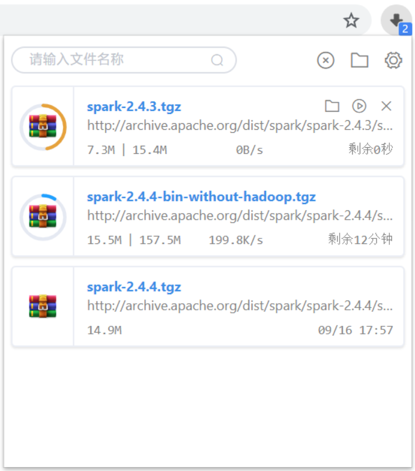

# **download-manager**
[](https://www.travis-ci.org/xinghaixuanwo/download-manager)

[](https://chrome.google.com/webstore/detail/ofpglhlcdbjdhlacgbljnildhajfmlei)
[](https://chrome.google.com/webstore/detail/ofpglhlcdbjdhlacgbljnildhajfmlei)
[](https://chrome.google.com/webstore/detail/ofpglhlcdbjdhlacgbljnildhajfmlei)

Google Chrome Download Manager Plugin

Click on the plugin icon to see the status of all downloaded files.

**[简体中文](../README.md) | [English](docs/README_EN.md)**

### **Features**
1. Download file percentage progress display
2. Download files can be paused, resumed, cancelled, deleted
3. Search all downloaded files
4. When prompted to download a dangerous file
5. Right click to copy file name and download link to clipboard
6. Notification during download
7. Download completion tone
8. Shortcut

### **Future plan**
1. Custom theme

### **Info**
[Chrome Webstore Plugin Address](https://chrome.google.com/webstore/detail/%E4%B8%8B%E8%BD%BD%E7%AE%A1%E7%90%86%E5%99%A8/ofpglhlcdbjdhlacgbljnildhajfmlei)

**Latest version**：0.8.4

Add
1. Shortcut

optimization
1. Settings interface display



### **Build & Package**
```
# Load dependency
npm install

# Compile and package
npm run build
```

### Help
If you have any questions, please create issues
Or
send a email `xinghaixuanwo@outlook.com`
