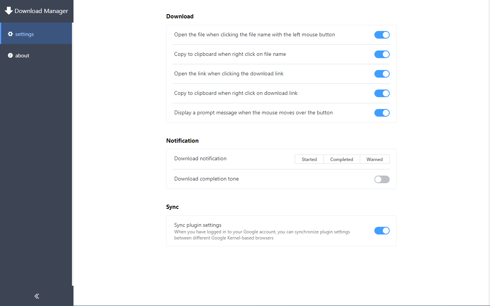

# **download-manager**
[](https://www.travis-ci.org/xinghaix/download-manager)


[](https://github.com/xinghaix/download-manager/blob/master/LICENSE)

[](https://chrome.google.com/webstore/detail/ofpglhlcdbjdhlacgbljnildhajfmlei)
[](https://chrome.google.com/webstore/detail/ofpglhlcdbjdhlacgbljnildhajfmlei)
[](https://chrome.google.com/webstore/detail/ofpglhlcdbjdhlacgbljnildhajfmlei)

[](https://microsoftedge.microsoft.com/addons/detail/phalbpghhjknlmomkmimbamfceiddlic)
[](https://microsoftedge.microsoft.com/addons/detail/phalbpghhjknlmomkmimbamfceiddlic)

Google Chrome Download Manager Plugin  
Click on the plugin icon to see the status of all downloaded files.

### 1. Language
**[简体中文](../README.md) | [English](README_EN.md)**

### 2. Download
[Chrome Web Store](https://chrome.google.com/webstore/detail/%E4%B8%8B%E8%BD%BD%E7%AE%A1%E7%90%86%E5%99%A8/ofpglhlcdbjdhlacgbljnildhajfmlei) 、
[Microsoft Edge Add-ons](https://microsoftedge.microsoft.com/addons/detail/phalbpghhjknlmomkmimbamfceiddlic)

### 3. [Privacy Policy](Privacy_EN.md)

### **4. Features**
1. Download file percentage progress display
2. Download files can be paused, resumed, cancelled, deleted
3. Search all downloaded files
4. When prompted to download a dangerous file
5. Right click to copy file name and download link to clipboard
6. Notification during download
7. Download completion tone
8. Shortcut
9. Download the file manually
10. Right-click download menu
11. Custom icon color
12. Custom theme

### **5. Supported Language**
`简体中文`、`English`、`Japanese`、`German`、`Russian`、`French`

This is the result of using Google Translate. 
If you have better suggestions, please create Issues or send emails!

**Steps:**
1. Location of all translation files: public/_locales/\*\*/*.json
2. Enter the corresponding language directory
3. Copy, download or Pull Request modified files. It will be in next version after checking.

### **6. Future Plan**    
The following features are developing in order 😂:
1. Solve the problem that the file that failed to retry downloading becomes a newly created download
2. Customize the download panel theme
3. Obsessive-compulsive disorder series: only display the name of the downloaded file, the download panel stops showing the flying in and flying out animation
4. Proxy settings

### **7. Info**
#### **7.1. Latest Version**：1.1.3
What's New:
1. Download notifications can remain on the screen
2. Customize the download panel page size. Settings -> Theme -> Download panel




### **8. Build & Package**
```
# Load dependency
npm install

# Compile and package
npm run build
```

### 9. Help
If you have any questions or ideas, please create issues
or
send <a href="mailto:xinghaixw@outlook.com">email</a> to me
